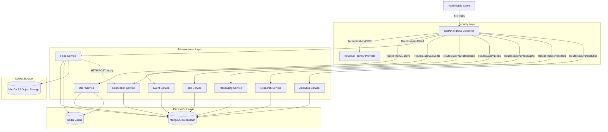

# Social Media Microservices Platform - Architecture

This document maps out the logical and deployment architecture of the MiniProject Social Media platform. It runs on a Kubernetes cluster (Minikube in dev) using a containerized NestJS microservice architecture.

## High-Level System Architecture

## Component Details

1. **NGINX Ingress Controller**: Handles TLS termination (via cert-manager), rate limiting, and path-based routing (`/api/v1/*`) directly to specific cluster IP services.
2. **Keycloak**: Handles User authentication, Identity provisioning, and JWT (JSON Web Token) creation using RS256/HS256 algorithms. Services validate JWTs locally via a synchronized JWKS public key or symmetric shared secret.
3. **NestJS Microservices**: Independent bounded contexts separated into distinct Kubernetes deployments and Node.js instances (User, Feed, Event, Notification, Job, Messaging, Research, Analytics).
4. **MongoDB ReplicaSet**: Centralized NoSQL document store mapped with Mongoose. Organized hierarchically (e.g. `users`, `posts`, `notifications` collections) to maintain relational sanity while supporting distinct bounded contexts.
5. **Redis Cache**: Offloads repetitive read queries, primarily caching Feed pagination `feed:page:*` to alleviate MongoDB spikes.
6. **MinIO**: S3-compatible object storage layer handling blob media files (user avatars, feed post images) triggered primarily by the Feed service.
